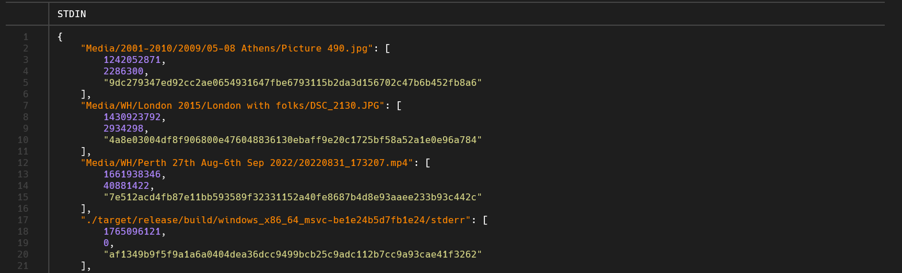

# check-file-dups

[](https://github.com/jamestyj/check-file-dups/actions/workflows/rust.yml)

A very fast and efficient cross-platform Rust CLI (Command Line Interface) tool to detect duplicate files. 

It can scan through hundreds of thousands of files within a few seconds after the initial run. On my desktop it takes ~6 seconds to (re)scan my full media library with ~100k files (3.2 TB) on a direct-attached 3.5" spinning hard disk (HDD).

## Why write another duplicate file finder?

Like many others, I have accumulated a significant amount of duplicate files over the years. These are mainly photos and videos that were duplicated due to poor digital hygiene, shared photo albums, etc. I needed a tool to help me identify and remove them.

Tested various tools but none fit my needs -- fast, cross-platform, and can run directly on my [NAS](https://en.wikipedia.org/wiki/Network-attached_storage). The initial version was written in Python, but it was slow and hard to run cross-platform. I also needed an excuse to learn [Rust](https://www.rust-lang.org/) and try out various vibe-coding tools.

## Sample output

### Duplicates found


### No duplicates found


## Features

### Performance

- **BLAKE3 hashing**: Fast cryptographic hashing optimized for speed
- **Intelligent caching**: Saves computed hashes to avoid recomputation on subsequent runs (10x+ speedup)
- **Parallel processing**: Multi-threaded file processing with configurable thread count
- **Efficient I/O**: 8KB buffer reads for optimal disk performance
- **Memory efficient**: Streams large files without loading them entirely into memory

### User Experience

- **Recursive scanning**: Scans all subdirectories automatically
- **Real-time progress**: Progress bar showing file count, size, speed, and ETA
- **Colored output**: Green success message when no duplicates are found
- **Space calculation**: Shows how much disk space duplicates are wasting
- **Intelligent sorting**: Duplicate groups sorted by wasted space (largest first)
- **Graceful shutdown**: Saves cache on Ctrl+C to preserve partial results

### Logging

- **Dual output**: Real-time console output plus detailed file logging (`check-file-dups.log`)
- **Timestamps**: Millisecond-precision format (`YYYY-MM-DD HH:MM:SS.mmm`)
- **Log levels**: INFO for general operations, WARN for duplicate findings

## Under the Hood

The codebase is organized into six main modules, each with specific responsibilities:

### [`cache.rs`](src/cache.rs) — Hash Cache System

This module implements a thread-safe hash cache system that significantly improves performance on subsequent scans by caching computed [BLAKE3](https://github.com/BLAKE3-team/BLAKE3) file hashes. The cache is persisted to disk as [Zstandard](https://github.com/facebook/zstd) compressed [JSON](https://www.json.org/json-en.html).

- **Core Data Structure**: The cache uses `Arc<Mutex<HashMap<String, (u64, u64, String)>>>` to store file paths mapped to tuples containing modification time (as Unix timestamp), file size in bytes, and the BLAKE3 hash as a hexadecimal string. The `Arc` (Atomic Reference Counting) allows the cache to be safely shared across multiple threads, while the `Mutex` ensures exclusive access during reads and writes.

- **Serialization Strategy**: The cache leverages `serde_json` for JSON serialization, which provides human-readable output that can be inspected for debugging. The JSON is then compressed using `zstd` (Zstandard) with compression level 9, balancing compression ratio against encoding speed. For a typical cache with 100,000 entries, the uncompressed JSON might be 50MB but compresses down to around 5MB.

- **Cache Validation Logic**: The `get_hash()` method implements a robust validation strategy that checks both modification time and file size before returning a cached hash. This dual-check approach prevents false cache hits when files are modified but happen to retain the same size, or when filesystem timestamps are manipulated. If either value differs from the cached entry, the method returns `None`, triggering a fresh hash computation.

- **Multi-threaded Compression**: When saving the cache, the module automatically detects the number of available CPU cores using `std::thread::available_parallelism()` and configures the Zstandard encoder to use all cores for parallel compression. This can reduce save times from several seconds to under a second on multi-core systems.

- **Cross-platform Path Handling**: To ensure cache portability between Windows, macOS, and Linux, all file paths are normalized to use forward slashes (`/`) and are stored relative to a configurable base path. This allows a cache generated on Windows to be used on Linux and vice versa, as long as the relative directory structure is the same.

- **User Feedback**: The module provides visual feedback during potentially long-running operations through `indicatif` spinners. During cache loading and saving, a spinner displays the operation in progress along with the cache file size in human-readable format (e.g., "5.2 MB").

### [`cli.rs`](src/cli.rs) — Command-Line Interface

This module defines the command-line interface using the `clap` crate's powerful derive macros, which automatically generate argument parsing code, validation, and help text from struct annotations.

- **Help Text Wrapping**: The module enables `clap`'s `wrap_help` feature, which automatically wraps long help text to fit the terminal width.

- **Documentation Integration**: Multi-line doc comments (using `///`) are automatically extracted by `clap` and displayed in the `--help` output. This ensures that the documentation stays synchronized with the code and provides users with detailed guidance directly in the terminal.

### [`duplicates.rs`](src/duplicates.rs) — Duplicate Detection and Reporting

This module contains the core duplicate detection algorithm and results formatting to help users identify and prioritize duplicate files.

- **Detection Algorithm**: The `find_duplicates()` function implements a hash-based grouping algorithm using a `HashMap<String, Vec<FileInfo>>`. It iterates through all scanned files, using each file's hash as the key and accumulating files with identical hashes into vectors. After grouping, it filters out any hash keys with only a single file, retaining only groups where duplicates exist. This approach has O(n) time complexity where n is the number of files.

- **Intelligent Sorting**: Duplicate groups are sorted by wasted space in descending order (largest first). The wasted space for a group is calculated as `file_size × (count - 1)`, since keeping one copy is necessary. This prioritization focuses on the duplicates that consume the most disk space first, maximizing the impact of cleanup efforts.

- **Metrics**: The module calculates two key metrics across all duplicate groups: total duplicate count (sum of all duplicates, excluding one copy per group) and total wasted space (sum of wasted space across all groups).

- **Output Formatting**: The module uses the `colored` crate to provide visual feedback through color-coded output. When no duplicates are found, a green success message is displayed. When duplicates exist, the module uses the `warn!` log level to ensure the output is visible. File sizes are formatted using `indicatif`'s `HumanBytes` formatter, which displays sizes in human-readable units (KB, MB, GB) rather than raw byte counts.

- **Path Truncation**: To keep output clean and readable, the module strips the base path from all file paths before display. This is particularly useful when scanning a specific subdirectory or mounted drive, as it removes redundant path prefixes and focuses attention on the meaningful parts of the path.

### [`lib.rs`](src/lib.rs) — Shared Types

This module defines the shared data structure used throughout the application.

- **FileInfo Structure**: The `FileInfo` struct represents a scanned file with three essential fields. The `path` field (type `PathBuf`) stores the absolute path to the file. The `size` field (type `u64`) stores the file size in bytes, used for sorting and wasted space calculations. The `hash` field (type `String`) stores the BLAKE3 hash as a 64-character hexadecimal string.

### [`main.rs`](src/main.rs) — Application Entry Point

This module orchestrates the entire application workflow, handling initialization, configuration, execution, and graceful shutdown.

- **Logging Configuration**: The module sets up dual logging, writing to both the console (with colored output) and a log file (`check-file-dups.log` in the current directory). The log format includes millisecond-precision timestamps to aid performance analysis and debugging. Falls back to UTC if the local offset cannot be determined (common in some containerized environments).

- **Configuration Loading**: The module looks for an optional `check-file-dups.toml` configuration file in the current directory.

- **Signal Handling**: Handles Ctrl+C for graceful shutdown -- saves the cache to disk, logs the interruption, and exits with status code 130 (the standard Unix convention for SIGINT termination). This ensures that partial scan results are preserved in the cache, for fast resumes.

- **Cache Management**: A global `Arc<HashCache>` is created and cloned for the signal handler, allowing the cache to be saved from both the normal exit path and the signal handler. The `--no-cache` flag is checked before each save operation to respect the user's preference.

- **Error Handling**: The module uses `anyhow::Result` throughout, which provides ergonomic error propagation with the `?` operator and automatic error context. If any critical error occurs (file I/O failure, invalid configuration, etc.), the error is propagated to the top level where it's displayed to the user with a full error chain.

- **Performance Tracking**: The module records the start time using `std::time::Instant::now()` and logs the total elapsed time at the end using `indicatif`'s `HumanDuration` formatter, which displays durations in human-readable format (e.g., "2m 34s" instead of "154 seconds").

### [`scanner.rs`](src/scanner.rs) — Directory Traversal and Hashing

This module implements the core scanning functionality, combining recursive directory traversal with parallel file hashing to achieve maximum performance.

- **Two-Pass Scanning Strategy**: The module uses a two-pass approach for optimal user experience. The first pass quickly walks the directory tree using `walkdir`, counting files and directories while calculating total size. This allows the module to display accurate statistics (e.g. "Found 12,450 files in 45 subdirectories (2.3 GB)") and initialize a progress bar with a known total. The second pass performs the actual hashing with real-time progress updates.

- **Directory Traversal**: The `walkdir` crate handles recursive directory traversal with symlink following enabled, allowing the tool to scan through symbolic links. The skip directory filter checks each path against the configured `skip_dirs` list, logging skipped paths at the WARN level for visibility. This filtering happens during traversal, avoiding unnecessary descents into excluded directories.

- **Parallel Processing Architecture**: The module uses `rayon` for data parallelism, configuring a global thread pool with the user-specified thread count. The file paths are collected into a `Vec` and then processed in parallel using `par_iter()`, which automatically distributes work across threads. Each thread independently hashes files and updates shared atomic counters for progress tracking.

- **BLAKE3 Hashing**: The `calculate_file_hash()` function uses the BLAKE3 cryptographic hash algorithm, which is significantly faster than SHA-256 while providing equivalent security. Files are read in 8KB chunks (a sweet spot for most filesystems), and the hash is computed incrementally without loading the entire file into memory. This streaming approach allows the tool to handle arbitrarily large files efficiently.

- **Cache Integration**: Before hashing each file, the function checks the cache using `get_hash()`. If a valid cached hash exists (matching both modification time and size), it's returned immediately, avoiding disk I/O and computation. After computing a new hash, the function updates the cache using `set_hash()`, ensuring future scans benefit from the cached result.

- **Progress Tracking**: Real-time progress is displayed using an `indicatif` progress bar with a custom template showing percentage complete, elapsed time, a visual progress bar, estimated time remaining, and current throughput in bytes per second. Progress updates are throttled to every 200ms to avoid excessive terminal I/O, which could slow down the scan.

- **Thread-Safe Counters**: The module uses `AtomicUsize` for counting processed files and `AtomicU64` for tracking processed bytes. These atomic types allow lock-free updates from multiple threads, avoiding the overhead of mutex contention. The `fetch_add()` operation atomically increments the counter and returns the previous value, ensuring accurate counts even with concurrent updates.

- **Error Handling**: The module uses a `Vec<Result<FileInfo>>` to collect results from parallel processing. Files that fail to hash (due to permission errors, I/O errors, etc.) are logged at the ERROR level but don't stop the scan. This resilient approach ensures that a few problematic files don't prevent the entire scan from completing.

## Installation

### Requirements

- Rust 1.90 or later
- Operating System: Windows, macOS, or Linux

### From Source

1. Install Rust: <https://rust-lang.org/tools/install>.
2. Clone this repository. For example:

    ```term
    > git clone git@github.com:jamestyj/check-file-dups.git
    > cd check-file-dups
    ```

3. Build the project.

    ```term
    > cargo build --release
    ```

    Sample output:

    ```term
    > cargo build --release
    Compiling getrandom v0.3.3
    Compiling proc-macro2 v1.0.101
    ...
    Compiling check-file-dups v0.1.0 (C:\code\check-file-dups)
     Finished `release` profile [optimized] target(s) in 8.02s
    ```

## Usage

### Display help

Run with `--help` to display command arguments and options. For example:

```term
> .\target\release\check-file-dups --help
A CLI tool to find duplicate files in a directory

Usage: check-file-dups.exe [OPTIONS] [PATH]

Arguments:
  [PATH]  Directory to scan for duplicates [default: .]

Options:
  -t, --threads <THREADS>  Number of parallel threads for hashing. Use multiple threads if the
                           images are on NVMe SSD (e.g. CPU is the bottleneck). Otherwise a
                           single thread (default) is typically faster [default: 1]
  -n, --no-cache           Skip using hash cache and compute all hashes fresh. For performance
                           testing / benchmarking optimal number of threads to use [default: false]
  -p, --prune-cache        Remove cache entries for files that no longer exist on disk.
                           Useful for cleaning up the cache after files have been deleted or moved [default: false]
  -h, --help               Print help
```

### Configuration file

To configure the tool, copy [`check-file-dups.example.toml`](./check-file-dups.example.toml) to `check-file-dups.toml` and customize it.

```toml
# check-file-dups configuration file
#
# Copy this file to check-file-dups.toml to customize behavior

# base_path: The base path to strip from the file paths in output.
# Useful if scanning a mounted drive or specific subdirectory.
# Example: base_path = "C:\\path\\to\\scan"
base_path = ""

# skip_dirs: List of directory names or paths to skip during scanning.
# Example: skip_dirs = ["@eaDir", "Lightroom Backups"]
skip_dirs = []
```

### Cache maintenance

The tool maintains a hash cache file (`check-file-dups-cache.json.zst`) to speed up subsequent scans. Over time, this cache may accumulate entries for files that have been deleted or moved. You can clean up these stale entries using the `--prune-cache` option:

```term
> .\target\release\check-file-dups --prune-cache
```

This will:

1. Load the existing cache
2. Check each cached entry to see if the file still exists
3. Remove entries for non-existent files
4. Save the cleaned cache back to disk

The tool will log statistics about how many entries were pruned. For example:

```text
Pruned 1,234 of 10,000 cache entries (12.3% removed)
```

**Note**: The `--prune-cache` option is ignored if `--no-cache` is also specified.

## Development

### Inspect cache

You can inspect the hash cache on Linux or macOS with syntax highlighting by using the following one-liner:

```bash
> zstd -d check-file-dups-cache.json.zst --stdout | python -m json.tool | bat -l json
```

Sample output:



### Install dependencies

1. To install `bat` and `zstd` on Linux or macOS using [Homebrew](https://brew.sh/), run:

    ```bash
    > brew install bat zstd
    ```

2. Python is also required. Install it using your package manager or download it from [python.org](https://www.python.org/downloads/).
